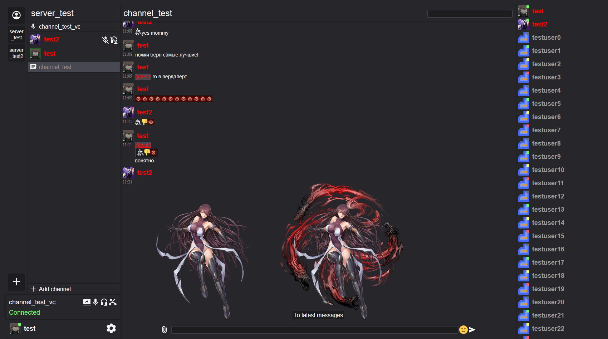
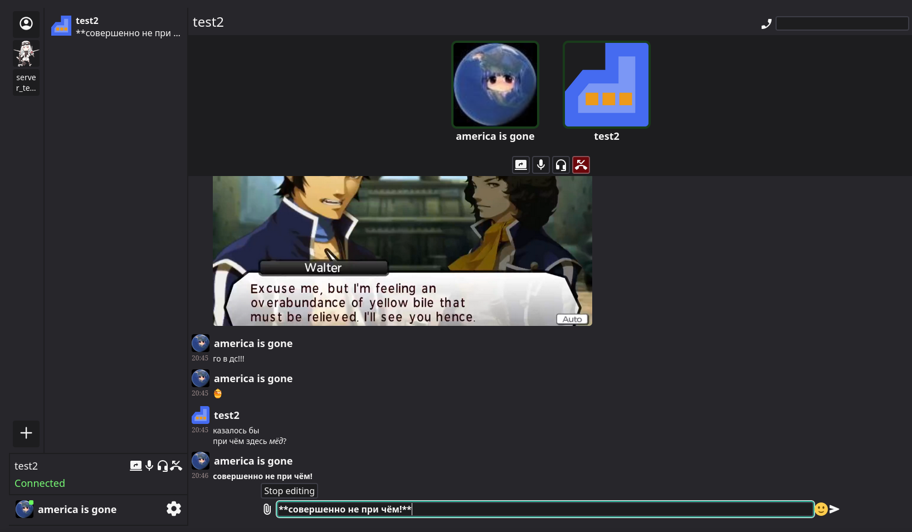

**ZavodChat** is a self-hosted voice and text chat web application, like Discord.

Supported features:

* Direct messages and calls
* Message attachments in form of images, files and links
* Markdown formatting
* Friend requests
* Blocking users
* Servers with text and voice channels
* Customizable roles that use a [permission](server/PERMISSIONS.md) system
* Private and read-only channels
* Kicking and banning users from servers
* Custom emojis for servers

Firefox 147+ and Chrome 125+ are supported.





## Running the server

```bash
docker-compose up --build
```

By default, client is hosted on address `https://localhost:5173/`.

You may need to visit these addresses first and allow your browser to continue, when using self-signed certificates (one is provided by default):

```
https://localhost
https://localhost:444 (Firefox only)
https://localhost:445 (Firefox only)
```

Host address and ports can be changed in `server/config.json` and `client/.env` (remember to change them in both files!).


## Acknowledgements

### Libraries

**Server-side:**

JSON: [json](https://github.com/nlohmann/json)

HTTP resources: [libhttpserver](https://github.com/etr/libhttpserver)

WebSockets: [IXWebSocket](https://github.com/machinezone/IXWebSocket)

WebRTC: [libdatachannel](https://github.com/paullouisageneau/libdatachannel)

Postgres: [libpqxx](https://github.com/jtv/libpqxx)

Multi-threaded hashmaps: [phmap](https://github.com/greg7mdp/parallel-hashmap)


**Client-side:**

Core: [svelte](https://github.com/sveltejs/svelte)

HTTP requests: [axios](https://github.com/axios/axios)

Experimental noise supression: [rnnoise](https://github.com/xiph/rnnoise)

Balanced binary search trees: [bintrees](https://github.com/vadimg/js_bintrees)

Markdown parsing and rendering: [marked](https://github.com/markedjs/marked)

Markdown code blocks highlighting: [markdown-hljs](https://github.com/Anyass3/markdown-hljs)


### Assets

Icons: [Material symbols by Google](https://icon-sets.iconify.design/material-symbols/page-2.html)

Emoji: [twemoji](https://github.com/twitter/twemoji/tree/master)
